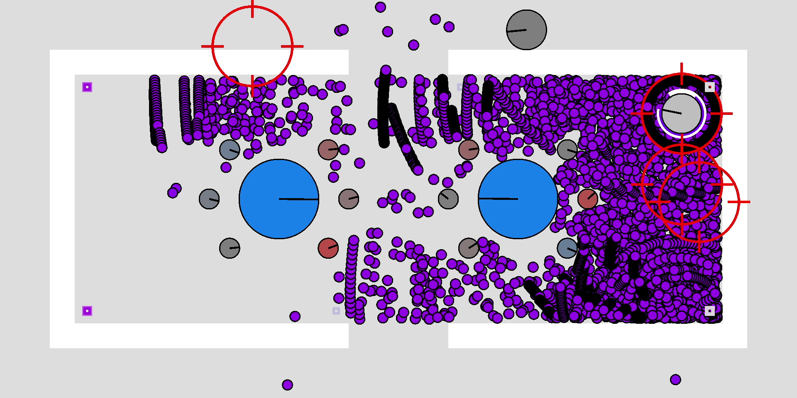

# PowerTanks Battle

The C++ upgrade of my [JavaScript game](https://uncreativeusername.neocities.org/tanks.html).

## Getting Started

(The video's small size is because GIFs don't have codecs for compression, and GitHub doesn't allow embedding MP4s...)

### Requirements

* OpenGL 3.3 or later
    * Earlier versions not supported; 3.3+ is required for instanced rendering of the bullets, allowing far better performance
    * Your GPU almost certainly supports this (yes, even if it's an ancient Thinkpad)
        * Apparently there are some Windows ARM laptops that only support DirectX, so those aren't supported
* 3GHz+ CPU recommended
    * Faster CPU -> more bullets on screen
    * The game can use more than one core, and the performance increases somewhat, but not a lot
* ~200MB RAM
* No audio requirements, because there's no audio
* OS: Windows x64 or Linux x64
    * Mac OS dropped support for OpenGL when they switched to ARM, also I don't have a Mac to test on; if you want to try your luck, look into [ANGLE](https://en.wikipedia.org/wiki/ANGLE_(software))
    * ARM should be possible to support but I don't have an ARM device to test on, and RISC-V has extremely few consumer devices

[Download here](https://github.com/tanksdude/tanks-game/releases) (Windows-only build; Linux has to compile from source, see below)

### Building (Windows)

1. Install Visual Studio 2022
1. Build x64 Release (on the solution, not project)
1. **[Pre-compiled executables](https://github.com/tanksdude/tanks-game/releases)** are provided if this isn't an option for you

### Building (Linux)

1. Prerequisites: a compiler and CMake: `sudo apt install build-essential cmake`
1. GLFW and GLEW: `sudo apt install libglfw3-dev libglew-dev`
    * non-Debian systems currently untested
    * compiling these from source is currently unsupported, sorry
        * Alpine (an extremely lightweight distro probably intended for embedded work), Gentoo (a distro known for compiling everything yourself), ChromeOS (known for being ChromeOS (and did you know it's [based on Gentoo?](https://en.wikipedia.org/wiki/ChromeOS#Architecture_2))), and even the non-Linux [Haiku](https://www.haiku-os.org/) (which I only heard about by reading other projects' CMake files) have prebuilt packages for GLFW and GLEW, so you really should be okay on your distro of choice
1. `mkdir build && cd build`
1. `cmake .. -DCMAKE_BUILD_TYPE=Release` (optional and recommended: `-DCMAKE_CXX_FLAGS=-march=native -DCMAKE_C_FLAGS=-march=native`)
1. `make -j$(nproc)`
1. TODO: also needs `res/` and `tanks.ini` copied to the build dir
1. Note: On Ubuntu, going fullscreen seems to force the window to the largest monitor, unless "Auto-hide the Dock" is enabled. It appears that Ubuntu forces windows that are too large for the current screen (which means full height is too much due to the dock) to the largest screen.

## Making custom levels

Making your own levels is now a thing! (Although the levels are very simple, and they take a while to make.) How to do so:

1. Navigate to the `mods` folder.
1. Add a new folder. This will be the name of your mod.
1. Add a `levels` folder to your mod's folder. Your custom levels go here.
1. Add some text files and make your custom levels!
1. Several fields need to be given. I suggest looking at one of the pre-made custom levels and copying it and modifying it.
1. Every level needs a `Name` (string), `Color` (3 floats in range [0,1] for RGB), `LevelTypes` (at least one string; recommended "modname" and "random-modname"), and `LevelWeights` (1 float for each type; recommended 1.0 is the base weight).
1. Optionally, levels can contain a `RandomStartPositionCount` (int, default = 5, for number of starting positions), `RandomStartPositionXValue` (float, default = 20, x-distance from edge), and `RandomStartPositionYRange` (float, default = 256=320-2*32, y-range for starting positions).
1. Once the assignments have been set, `[LEVEL_START]` needs to appear, then you can start adding walls and powers and stuff.
1. Look at `docs/custom-levels.md` for more information.

The custom level interpreter is very simple and barebones, so if you want to put something at the center, you have to put the coordinates as `320 160` instead of `GAME_WIDTH/2 GAME_HEIGHT/2`. Also you can't do any math to your numbers; they need to be the raw numbers (no "sqrt(3)" or "20*8", just "5" or whatever). I know this sucks but adding an expression parser is annoying [(although there is a popular library for this task)](https://github.com/ArashPartow/exprtk) and adding Lua (or maybe Python?) would've been a much larger hurdle [(although this Wikipedia list is much larger than the last time I looked at it so maybe it's easier than I thought?)](https://en.wikipedia.org/wiki/List_of_applications_using_Lua).

## Making custom powers

Making your own powers is also now a thing! (Although very limited.) How to do so:

1. Follow the same steps as making custom levels, but add a `powers` folder in your mod's folder.
1. Every power needs a `Name` (string), `Color` (3 floats in range [0,1] for RGB), `PowerTypes` (at least one string; recommended "modname" and "random-modname"), and `PowerWeights` (1 float for each type; recommended 1.0 is the base weight).
1. Optionally, powers can contain a `PowerTankDurationMultiplier` (float, default = 1.0, for the duration the tank has the power) and `PowerAttributes` (strings, default = "stack" and "mix", just something to help when randomizing powers)
1. Once the assignments have been set, do `[TANKPOWER_START]` to set up the tank power, then `[BULLETPOWER_START]` to set up the bullet power.
1. Check the provided powers for syntax and stuff. They contain basically every operation currently available.
1. Look at `docs/custom-powers.md` for more information.

The custom power interpreter is also very simple and barebones.

## Running the tests

~~Will come soon™.~~

## Documentation

I didn't find a good way to easily build documentation, so... the documentation is quite lacking. However, there is some. Check the `docs` folder.

## Built With

* [Visual Studio (2022)](https://visualstudio.microsoft.com/) - C++ IDE from Microsoft
* [GFLW](https://www.glfw.org/) - OpenGL Framework (or Graphics Library Framework); cross-platform way to make windows and get inputs
* [GLEW](https://glew.sourceforge.net/) - OpenGL Extension Wrangler Library; for getting the latest OpenGL commands (where "latest" is >1.1)
* [OpenGL Mathematics (GLM)](https://github.com/g-truc/glm) - OpenGL-happy matrix and vector math library
* [enkiTS](https://github.com/dougbinks/enkiTS) - Thread scheduler for easily managing multithreading
* [rpmalloc](https://github.com/mjansson/rpmalloc) - Memory allocator, for some extra performance
* [stb_image](https://github.com/nothings/stb) - Image loader for loading the window icon

## Contributing

This is my personal project so I won't be taking others' contributions. (Plus I've learned so much and would rather make a sequel at this point.) If you wanna do something with this project, you can fork this repository and do whatever you want.

## License

GNU General Public License v3.0

`SPDX-License-Identifier: GPL-3.0-only`

## Acknowledgments

* JS Tanks (made by me): [tanks.html](https://uncreativeusername.neocities.org/tanks.html)
    * the JS version has significantly less stuff and way worse power mixing, so play this C++ version instead!
* Many people across the Interwebs who made StackOverflow and other forum posts
* Lots of YouTube tutorials, GDC talks, and my CS professors providing assistance
* The vague inspiration I had for this game back when I made it: some top-down Flash tank game. I've tried searching for it multiple times but have never found it, so given my continuously fading memories of that game I played, I'll probably never find out what it actually was. (No, it wasn't Wii Tanks (that's not a Flash game, come on!). I think the game had a more cartoonish than realistic artstyle. I don't remember if there were powerups. My closest guess was some old Atari game remade in Flash, but my searches didn't find anything useful.)

## More acknowledgements

* [Super Smash Bros.](https://www.smashbros.com/en_US/index.html) for being a very fun game
    * (Smash Bros the *party* game, not the competitive fighting game; use items!)
* [The Cherno](https://www.youtube.com/@TheCherno/videos) is very helpful for OpenGL
* [Solarian Programmer](https://solarianprogrammer.com/) has good starter code for hardware rendering
* [Factorio](https://www.factorio.com/)'s Friday Fun Facts are amazing and got me interested in low-level C++ optimizations
* [Nitronic Rush](https://nitronic-rush.com/) is the other game that made me want to learn C++ in the first place
* [Dolphin emulator's Progress Reports](https://dolphin-emu.org/blog/) for being very in-depth and good reading material
* [N++](https://www.nplusplus.org/) for just being a good game (also the developers had some [good GDC talks](https://www.youtube.com/watch?v=VZ4xevskMCI) and have a [useful game development blog](https://www.metanetsoftware.com/technique/tutorialAbak.html))
* [Creeper World](https://knucklecracker.com/creeperworld4/cw4.php) for also just being a good game
* [Outer Wilds](https://www.mobiusdigitalgames.com/outer-wilds.html) for just being a really good game
